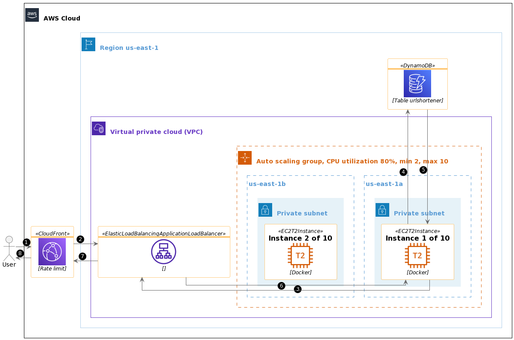

# Question 1

In this lab, we will run our Rust application on Amazon Linux 2 (AL2) with docker

## Explaination
The image above shows how it works
1. User request our Rust application through Cloudfront
    * If cache hit, Cloudfront will return the cache
    * If cache miss, go to 2
2. Cloudfront, has ALB set as its origin, forward the request to ALB
3. The ALB listener has a ASG set as its target group's target therefore forward the request to one of the instances in the ASG
4. The Rust application received the request and ask Dynamodb table `urlshortener-jjxzbdbayxatn` for data
5. The Dynamodb return the data
6. The Rust application sends a response back to ALB
7. The response return to Cloudfront
8. The response return to user

## System design
The goals of the design are
* To provide a HA solution
* There should be no single point of failure
* Runs on native AL2 with docker installed
* Application packed in container image for easy deploy and update
* Scalable when traffic increases or decreases with no code change

Table below is a summary of our components
|Component|Choice|Self-hosted or managed|Global or regional|
|---|---|---|---|
|Cache|Cloudfront|Managed|Global|
|Rate limiting|WAF (Web ACL)|Managed|Global|
|Load balancer|ALB|Managed|Regional|
|Auto scaling|ASG|Managed|Regional|
|OS|AL2|Self-hosted|x||
|Orchestrator|Docker|Self-hosted|x|
|Programming language|Rust|x|x||
|Database|Dynamodb|Managed|Regional (can be global)|

Our choice:
* Cloudfront as our cache can improve performance at the same time we can implement our rate limit policy through WAF Web ACL
* Application Load Balancer (ALB) as our load balancer and placed it in 2 **public** subnets (us-east-1a and us-east-1b) within a VPC for HA
* Auto Scaling Group (ASG) to manage our AL2 instances across the 2 **private** subnets (for HA) with target tracking scaling policy (CPU utilization 80%) to scale in and out within our range of 2 to 10 instances
* Amazone Linux 2 (AL2) as our OS for its security and native support
* Docker as our container orchestrator to run our docker image
* Rust for our application
* Dynamodb as our database which is a managed service, we deploy it in a region (us-east-1), it is HA by design. Access for Dynamodb is grant through a shared instance profile on table level
## Run instructions
### CDK (Typescript)
Follow the following page to setup awscli and cdk

https://docs.aws.amazon.com/cdk/v2/guide/getting_started.html#getting_started_prerequisites

To run our cdk

```sh
cd cdk-question-1/
npm i
cdk synth
cdk deploy
```
### Urlshortener

To run our urlshortener

```sh
cd urlshortener/
docker build -t urlshortener .
docker run -p8000:8000 -d -e DOMAIN=https://mydomain.com urlshortener
```
Or simply
```sh
docker run -p8000:8000 -d -e DOMAIN=https://mydomain.com whshk/jjxzbdbayxatn:v1
```
Note that this image is design to run on AL2, please check [`cdk-question-1-stack.ts`](https://github.com/RoDFOPAV49bGd/JJXZbdBayXaTn/blob/407f9321a40d03aeabfdf9933171c606b19a80ae/cdk-question-1/lib/cdk-question-1-stack.ts#L81-L82) for more details, or you may need to add the following argument `-v /my/home/directory/.aws/:/root/.aws/`
### PlantUML
To run our PlantUML

https://www.planttext.com/

Copy the raw [`question1-arch.puml`](https://github.com/RoDFOPAV49bGd/JJXZbdBayXaTn/raw/master/question1-arch.puml) and paste it into the editor

## Deliverables
* CDK written in Typescript - [`cdk-question-1-stack.ts`](https://github.com/RoDFOPAV49bGd/JJXZbdBayXaTn/blob/master/cdk-question-1/lib/cdk-question-1-stack.ts)
* Urlshortener written in Rust - [`urlshortener/src/`](https://github.com/RoDFOPAV49bGd/JJXZbdBayXaTn/tree/master/urlshortener/src)
* Architecture diagram written in PlantUML - [`question1-arch.puml`](https://github.com/RoDFOPAV49bGd/JJXZbdBayXaTn/raw/master/question1-arch.puml)
## Assumptions and limitations
* The [`DOMAIN`](https://github.com/RoDFOPAV49bGd/JJXZbdBayXaTn/blob/db919bd317bc29e76f3aaf71fd7d94fb2caa1382/urlshortener/src/main.rs#L48) is an environment variable only know after Cloudfront is provision
    1. We need to first update our CDK [user data](https://github.com/RoDFOPAV49bGd/JJXZbdBayXaTn/blob/22b6ae1f895a22f719d506cb5648c312607787e3/cdk-question-1/lib/cdk-question-1-stack.ts#L77)
    2. Follow by an instance refresh to get the correct `shortUrl`
# Question 2
In this lab, create 2 instances on AWS

We will choose **Amazon Linux 2** as our OS

Instance 1 will be our cronos node

Instance 2 will be our telemetry server

Install ansible and git on both instances
```sh
sudo amazon-linux-extras install ansible2 -y
sudo yum install git -y
```

Clone this repo on both instances
```sh
git clone https://github.com/RoDFOPAV49bGd/JJXZbdBayXaTn.git
cd JJXZbdBayXaTn/
```

On instance 1, run playbook cronos
```sh
ansible-playbook -idefault, -clocal playbook-cronos.yaml -e moniker=my-awesome-node
```

Whitelist port `26660` (metrics) in security group of instance 1

On instance 2, run playbook telemetry
```sh
ansible-playbook -idefault, -clocal playbook-telemetry.yaml -e cronos_node_ip=[instance 1 ip]
```

Whitelist ports below in security group of instance 2
* 3000 - grafana
* 9090 - prometheus

The url of grafana will be http://[instance 2 ip]:3000

The url of prometheus will be http://[instance 2 ip]:9090

Login grafana with username `admin` and password `admin`

Add a prometheus datasource with url `http://localhost:9090`

Create a new dashboard with [`dashboard.json`](https://github.com/RoDFOPAV49bGd/JJXZbdBayXaTn/raw/master/dashboard.json) as json model
## Deliverables
* Ansible playbook for cronos node - [`playbook-cronos.yaml`](https://github.com/RoDFOPAV49bGd/JJXZbdBayXaTn/raw/master/playbook-cronos.yaml)
* Ansible playbook for telemetry node - [`playbook-telemetry.yaml`](https://github.com/RoDFOPAV49bGd/JJXZbdBayXaTn/raw/master/playbook-telemetry.yaml)
* Grafana dashboard json - [`dashboard.json`](https://github.com/RoDFOPAV49bGd/JJXZbdBayXaTn/raw/master/dashboard.json)
## Assumptions and limitations
* The telemetry playbook only works on AL2
## Problems
* The cronos node metrics only contains `tendermint_mempool_size`, but not `tendermint_consensus_block_size_bytes`, `tendermint_consensus_num_txs` nor `tendermint_consensus_rounds`
